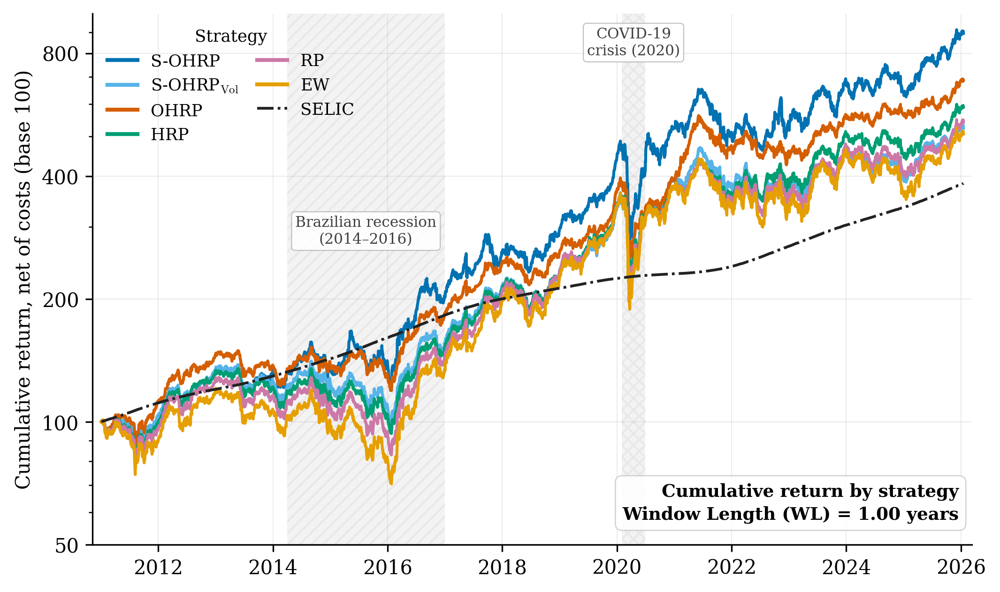

# OHRP 📈

### Hi! This is the OHRP library, where the code behind our research is made available for the community to analyze, test and extend 🤗

It implements the **Orthogonal Hierarchical Risk Parity** method published in *IEEE Access* and
now also carries **S-OHRP** and the **Sectoral Gini Index**, together with everything needed to
reproduce the experiments reported in my master's dissertation at PPGC/UFRGS.

As always, this is ongoing research and there is plenty left to improve. Contributions, questions
and issues are very welcome — please do get in touch. Only freely available data is included.

---

## What is in here 🧠

Three methods are implemented on top of the classical Hierarchical Risk Parity pipeline.

**OHRP — Orthogonal Hierarchical Risk Parity.** Instead of modifying the HRP machinery, OHRP
changes *what HRP sees*. Asset returns are projected onto a lower-dimensional orthogonal subspace
that preserves data locality (PCA followed by OLPP), and only then handed to hierarchical
clustering, quasi-diagonalization and recursive bisection. The projection parameters
`(k, d, r)` are re-optimized in-sample at **every** rebalancing, which turns a static
preprocessing step into an adaptive component of the strategy.

**S-OHRP — Sectoral OHRP.** A strict generalization of OHRP along two axes. First, the locality
graph only admits **intra-sector** edges, injecting an economic prior into the learned
representation and blocking the spurious cross-sector neighbours that hurt most when data are
scarce. Second, the in-sample selection is unified into a `δ·F` framework, where `δ` sets the
direction of the search and `F` is *any* scalar portfolio objective — so criteria such as the
Sharpe ratio become admissible alongside variance. Setting the sector partition to the whole
universe recovers OHRP exactly.

**SGI — Sectoral Gini Index.** A concentration measure that applies the Gini operator to
*sector-level aggregate weights*. It exposes something the asset-level Gini structurally cannot
see: a portfolio can be spread across dozens of tickers and still have its weight clustered in a
single economic sector. Running `tutorialSimpleOHRP.py` makes the point immediately — the equally
weighted portfolio scores a perfect `Gini = 0.00` and still lands at `SGI ≈ 0.31`.

---

## Out-of-sample results 📊

Cumulative returns of the six strategies at the one-year estimation window, the point where
S-OHRP reaches the best risk-adjusted performance of the whole study. Solid lines are gross of
costs, dashed lines net of 3 bps per rebalancing.



Headline findings from the dissertation, over 158 Brazilian stocks from January 2011 to
February 2026:

| | Result |
|---|---|
| **OHRP, risk** | Lowest annualized volatility at **every** window length tested (0.140–0.151, against 0.160–0.170 for HRP and ≈0.201 for EW), with a clean sweep of **27 out of 27** Wilcoxon comparisons, plus complete dominance in maximum drawdown and Pain Index |
| **OHRP, return** | Best cost-adjusted Sharpe ratio at seven of the nine long windows, peaking at 0.346 (WL = 2.5y) |
| **S-OHRP** | Best risk-adjusted performance of the entire study at WL = 1.00 year: Sharpe 0.381, Sortino 0.366 |
| **The price** | OHRP is the most concentrated (Gini 0.70–0.73) and most active (roughly twice the HRP turnover) |
| **SGI** | Risk Parity is the most sector-diversified strategy in every scenario (25/25 wins per regime); OHRP never wins a single SGI comparison, despite looking diversified at the asset level |

The investable universe, 158 tickers across 10 B3 economic sectors:


---

## Repository layout 🗂️

```
OHRP.py                      OHRP allocation method
SOHRP.py                     S-OHRP allocation method (sector-constrained, δ·F)
COLPP.py                     orthogonal locality-preserving projection core
HRP.py                       Hierarchical Risk Parity (de Prado, 2016)
RP.py                        Risk Parity benchmark (Ledoit-Wolf shrinkage)
EW.py                        Equally Weighted benchmark
Measures.py                  performance, drawdown and concentration metrics (incl. SGI)

simulationFund.py            the out-of-sample backtest driver
analise_experimentos.py      figures and statistical tables from the results
setores_b3.py                sector composition chart

tutorialSimpleOHRP.py        ① one window, every strategy, inspect the weights
tutorialSimulation.py        ② how the backtest works + a reduced-scale run
tutorialAnalysis.py          ③ how to turn results/ into figures and tables

tutorialDataExtraction.ipynb             IEEE Access article: download prices and SELIC
tutorialHyperparameterSensibility.ipynb  IEEE Access article: out-of-sample sensitivity to (k, d)

datasets/                    price, sector and risk-free data (see below)
results/                     simulation output — regenerated, not versioned (except the
                             sensitivity tables of the IEEE Access article)
docs/img/                    figures used by this README
```

The tutorials are plain `.py` files organised in `#%%` cells, so VS Code, Spyder and PyCharm all
render them as interactive notebooks while they stay readable in a plain diff.

The two notebooks come from the *IEEE Access* article and are kept as published.
`tutorialDataExtraction.ipynb` shows how the price matrix is built from Yahoo Finance and the SELIC
from the Brazilian Central Bank; `tutorialHyperparameterSensibility.ipynb` evaluates OHRP
out-of-sample over a grid of hyperparameters and reads its tables from `results/`.

---

## Getting started 🚀

```bash
pip install -r requirements.txt
python tutorialSimpleOHRP.py
```

That builds one allocation per strategy on a single one-year window and prints the weight
structure, the two concentration measures and the sector mix. It finishes in about a minute and
confirms the environment is sound.

### Reproducing the dissertation

```bash
python simulationFund.py        # fills results/ — hours, not minutes
python analise_experimentos.py  # run once per experiment (set the flag at the top)
python setores_b3.py
```

`simulationFund.py` runs both experiments:

| Experiment | Strategies | Window lengths |
|---|---|---|
| `ExperimentoSOHRP` | S-OHRP, S-OHRP (Vol), OHRP, HRP, EW, RP | 0.20 … 2.00 years, step 0.20 |
| `ExperimentoOHRP` | OHRP, HRP, EW, RP | 1.0 … 5.0 years, step 0.5 |

It skips any window length whose output already exists, so an interrupted run can simply be
relaunched. Be warned that the hyperparameter grid is 7 × 7 × 5 = 245 projections per method, per
rebalancing date.

**Protocol.** 158 Brazilian stocks (IBOV + SMLL) across 10 B3 sectors, January 2011 to February
2026, rolling windows of `WL × 252` trading days, 42-day holding periods giving 89 out-of-sample
portfolios per configuration, a 90% minimum-observation filter, 3 bps of transaction cost, and
SELIC as the risk-free rate. Pairwise comparisons use the Wilcoxon signed-rank test at 95%, with
Student's paired *t*-test reported as a secondary reference.

---

## Reproducibility 🔬

### Reference environment

The dissertation results were produced on the machine below. `requirements-dissertation.txt` pins
the Python packages.

| | |
|---|---|
| OS | Ubuntu 24.04.2 LTS, Linux 6.8.0, x86-64, glibc 2.39 |
| CPU | Intel Core i7-14700, 28 threads |
| Python | 3.11.13 (Miniconda) |
| Packages | numpy 2.3.0, scipy 1.16.1, pandas 2.3.0, scikit-learn 1.7.2, Riskfolio-Lib 7.0.1, cvxpy 1.7.2 |
| BLAS / LAPACK | OpenBLAS bundled with the pip wheels: 0.3.29 in numpy, 0.3.28 in scipy; `Haswell` kernel, pthreads, 28 threads |

Rerunning `simulationFund.py` there reproduced the stored results to floating-point precision
(largest deviation 3e-21 over the first two rebalancings of both experiments, all six strategies).

```bash
pip install -r requirements-dissertation.txt   # reference environment (Linux x86-64, Python 3.11)
pip install -r requirements.txt                # any platform, compatible recent versions
```

`requirements.txt` excludes pandas 3, which changes how returns are computed across price gaps.

### Why OHRP and S-OHRP depend on the platform

EW and HRP produce identical portfolios on every platform tested, and RP agrees within its
optimizer tolerance (1e-5). OHRP and S-OHRP do not: on Windows 11 (Intel Core i7-12700H) with
**exactly the same package and OpenBLAS versions**, they select different `(k, d, r)` from the first
rebalancing onwards. The cause was traced stage by stage on that first rebalancing (2011-01-03,
WL = 1 year), using the combinations the dissertation selected there: OHRP `(7, 10, 0.96)` and
S-OHRP `(5, 25, 0.98)`.

1. **Inputs are identical.** Returns, heat-kernel bandwidth, affinity matrix and degree matrix agree
   to 3e-17.
2. **PCA stage: eigenvector signs.** `COLPP.SVD` calls LAPACK's general eigensolver
   (`scipy.linalg.eig`) on XXᵀ. Eigenvalues agree to 1e-15 and eigenvectors to 6e-14, except
   for their sign, which is mathematically arbitrary and chosen differently by each platform's
   build: 19 of the 51 retained eigenvectors come back flipped.
3. **ARPACK stage.** `COLPP.build_weights` extracts the OLPP directions one at a time with ARPACK
   (`scipy.sparse.linalg.eigs`, `k=1`, `which="LR"`, `tol=1e-6`, starting vector `v0` = all ones).
   The flipped PCA basis hands ARPACK the same matrix in different coordinates (identical after
   undoing the flips, 1e-14). The fixed starting vector is not invariant to that change, so the
   iterations follow a different path. For OHRP, eigenvalues still agree to 1e-8 and eigenvectors to
   8e-7, within the tolerance, but 3 of the 10 projected dimensions come out with opposite sign.
4. **HRP turns signs into different weights.** HRP clusters assets by the Pearson correlation of
   their projected coordinates. That correlation removes the mean across dimensions, so it is not
   invariant to flipping one dimension for all assets. The flips change the correlation matrix by up
   to 0.65 and the HRP weights by up to 6.8 percentage points. After aligning the column signs, the
   OHRP weights agree to 1e-7: for OHRP the divergence is entirely the sign ambiguity, not rounding.
   `HRP.py` itself is platform-consistent, since it returns the same weights on both systems when
   given the same projection.
5. **S-OHRP adds non-unique eigenvectors.** With intra-sector edges only, the locality graph splits
   into disconnected components (10 in this window, one per sector). The leading eigenvalue of the
   OLPP problem becomes repeated: the first six ARPACK eigenvalues equal 1 to within 2e-7. The
   eigenvectors of a repeated eigenvalue are not unique, ARPACK returns a different basis of that
   eigenspace on each platform, and the projections still differ by up to 0.15 after sign
   alignment. The OHRP graph is connected and its eigenvalues are well separated (smallest relative
   gap 4%).
6. **The grid search picks another winner.** In-sample volatility moves by 2.5e-5 (OHRP) and 2.9e-4
   (S-OHRP), while the best `(k, d, r)` candidates are often within a fraction of a percent of each
   other. The selection changes, and from then on the whole portfolio path differs.

Package versions matter on their own as well: on the same Windows machine, moving from scipy 1.16
to scipy 1.17 already changes the combinations OHRP and S-OHRP select, whereas numpy 1.26 versus
2.4 makes no difference for OHRP.

In practice, the code runs on any platform and the methods behave as described in the dissertation,
but only the reference environment reproduces its exact OHRP and S-OHRP figures.

---

## Data 💾

Everything under `datasets/` is freely available data, pre-processed into ready-to-use matrices.

| File | Contents |
|---|---|
| `BR_equity_closing_prices.csv` | Daily adjusted closing prices, 158 tickers plus the IBOV and SELIC columns, 2002-01-01 to 2026-01-29. The dissertation uses the slice from 2011-01-03 onwards. |
| `SectoralBrazilianClassification.xlsx` | B3 economic sector for each ticker, matched by its reduced (4-letter) form |
| `SELIC_returns.csv` | Brazilian base interest rate, used as the risk-free benchmark |
| `IBOV_23-10-25.csv`, `SMLL_23-10-25.csv` | IBOV and Small Caps composition as of 2025-10-23 (ticker, Yahoo symbol, firm name, weight), used by the *IEEE Access* notebooks |
| `IBOV_equity_closing_prices.csv` | Daily closing prices of the IBOV constituents, 2010-01-04 to 2025-10-22, produced by `tutorialDataExtraction.ipynb` and read by `tutorialHyperparameterSensibility.ipynb` |

Only the data needed to replicate the dissertation and the *IEEE Access* tutorials is included
here. The fundamentals database used in a separate line of experiments is deliberately left out.

---

## Citation 📚

If this code is useful to you, please cite the work it comes from.

**Journal article — the OHRP method**

> PERGHER, K. G. R.; SOLDERA, J.; SCHARCANSKI, J. An Orthogonal Hierarchical Risk Parity
> Allocation Method for Improved Portfolio Out-of-Sample Performance. **IEEE Access**, v. 14,
> 2026. DOI: [10.1109/ACCESS.2026.3656702](https://doi.org/10.1109/ACCESS.2026.3656702)

**Conference paper — where the idea started**

> PERGHER, K. G. R.; SOLDERA, J.; SCHARCANSKI, J. Dynamic Orthogonal Lower Dimensional
> Projections for Improving Hierarchical Risk Allocation and Out of Sample Portfolio Returns.
> In: **2025 IEEE Symposium Series on Computational Intelligence (SSCI)**, Computational
> Intelligence for Financial Engineering (CIFEr) track, Trondheim, Norway, 2025. p. 1–5.
> DOI: [10.1109/CiFerCompanion65204.2025.10980404](https://doi.org/10.1109/CiFerCompanion65204.2025.10980404)

**Under review — S-OHRP and the SGI**

> PERGHER, K. G. R.; SOLDERA, J.; SCHARCANSKI, J. Enhancing Orthogonal Hierarchical Risk Parity
> with Sectoral Information for Out-of-Sample Portfolio Allocation. Under review at
> **Operations Research Forum**, 2026.

**Dissertation**

> PERGHER, K. G. R. *Orthogonal Hierarchical Risk Parity Methods for Portfolio Allocation in the
> Brazilian Stock Market*. Master's dissertation, Programa de Pós-Graduação em Computação,
> Universidade Federal do Rio Grande do Sul, Porto Alegre, 2026. Advisor: Prof. Dr. Jacob
> Scharcanski.

---

Thanks for your support and curiosity! 🙏
